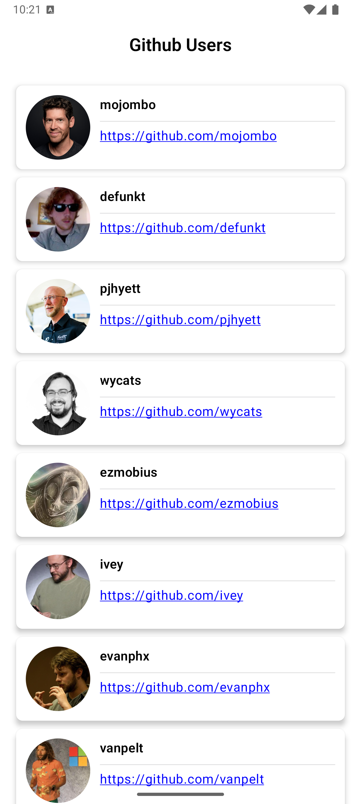
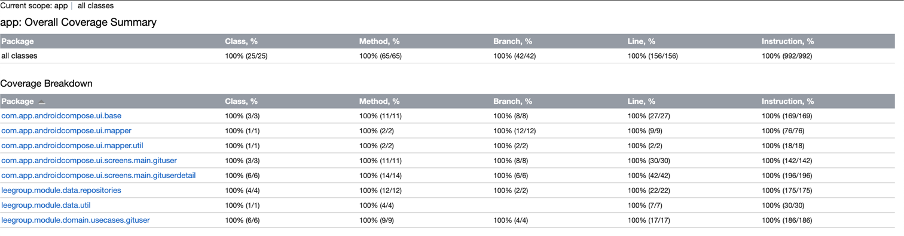

# GitUser

## Screenshots
| User List | User Detail|
|-|-|
|  |  |

## Apk builds
https://app.bitrise.io/app/d770b010-39d9-44af-a15a-4f6257c39878?workflow=workflow-build_apk

## Linter and static code analysis

- Lint:

```
$ ./gradlew lint
```

Report is located at: `./app/build/reports/lint/`

## Testing

- Run unit testing:

```
$ ./gradlew app:testStagingDebugUnitTest
$ ./gradlew data:testDebugUnitTest
$ ./gradlew domain:test
```

- Run unit testing with coverage:

```
$ ./gradlew koverHtmlReport
```

Report is located at: `app/build/reports/kover/`



## Build and deploy

For `release` builds, we need to provide release keystore and signing properties:

- Put the `release.keystore` file at root `config` folder.
- Put keystore signing properties in `signing.properties`
